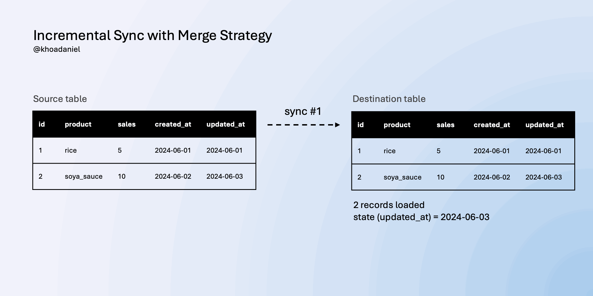
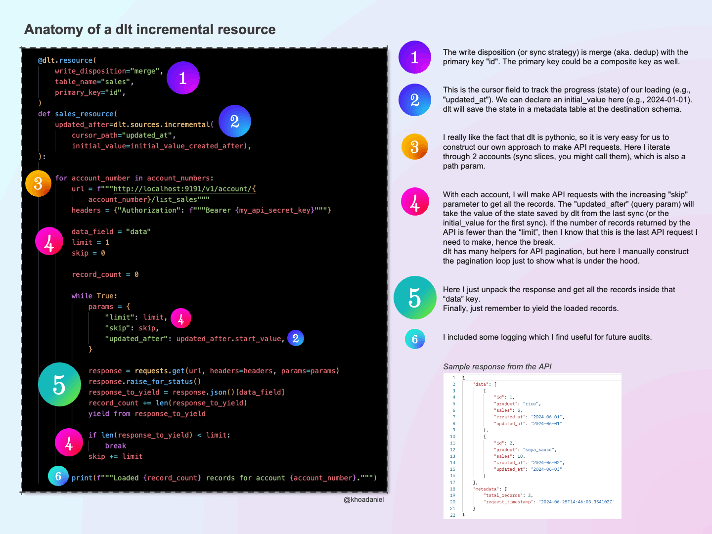

# Incremental Data Loading with dlt

**TLDR:**
This repo aims to give a simplified yet comprehensive guide on how to load data from APIs incrementally using the `dlt`.
It also provides a simple `locally-hosted API endpoint` for testing purposes.


*© Image by Author*

## PART 1: Deploy a GET API endpoint yourself for testing purposes
In the process of developing a script to extract data from an API, you may want to test your script with a locally-hosted API endpoint. It is so much easier and faster to debug.

To deploy a GET API endpoint locally, run the following commands in your terminal from the root directory of this repo:
```bash
cd api_get_endpoint
python -m venv .venv
source .venv/bin/activate
python -m pip install --upgrade pip
pip install -r requirements.txt

python get_endpoint.py
```

The endpoint will be available at http://127.0.0.1:9191/v1/account/{account_num}/list_sales

### About this GET API endpoint
The `/v1/account/{account_number}/list_sales` endpoint is designed to provide a listing of sales records from a local CSV file based on the specified account number. It allows filtering and pagination options through query parameters.

**Important:** To facilitate testing and simulate various scenarios, you are encouraged to edit the corresponding CSV files (simulated_db_1.csv or simulated_db_2.csv). This allows you see how the API behaves when new data is added or existing data is updated!

#### HTTP Method
GET

#### URL Path
/v1/account/{account_number}/list_sales

#### Path Parameters
- `account_number` (required): The unique identifier for the account. The value must be either 1 or 2. This parameter determines which CSV file (simulated_db_{account_number}.csv) the data is read from.

#### Query Parameters
- `updated_after` (optional): A date filter to retrieve records that have been updated after the specified date. The value should be in ISO 8601 date format (YYYY-MM-DD). If not provided, all records up to the current date are considered.
- `limit` (optional, default=10): The maximum number of records to return. This parameter helps in managing the size of data being fetched, facilitating easier data handling and quicker responses.
- `skip` (optional, default=0): The number of records to skip from the beginning of the result set. This is useful for implementing pagination in conjunction with the limit parameter.

#### Responses
- `200` OK: Returns a JSON object containing the filtered list of sales records and metadata about the request.
- `404` Not Found: Occurs if the CSV file corresponding to the provided `account_number` cannot be found.

#### Example Request
```bash
GET /v1/account/1/list_sales?updated_after=2023-01-01&limit=5&skip=0
````

#### Example Response
```json
{
    "data": [
        {
            "id": 1,
            "product": "rice",
            "sales": 5,
            "created_at": "2024-06-01",
            "updated_at": "2024-06-01"
        },
        {
            "id": 2,
            "product": "soya_sauce",
            "sales": 10,
            "created_at": "2024-06-02",
            "updated_at": "2024-06-03"
        }
    ],
    "metadata": {
        "total_records": 2,
        "request_timestamp": "2024-06-25T14:46:03.354102Z"
    }
}
```

## PART 2: Load data incrementally using dlt

### Test the script
#### Prerequisites
- You have your python installed.
- You deployed the GET API endpoint as described in PART 1.
- You provide the correct database credentials in `dlt_incremental_source_example/.dlt/secrets.toml` file.

#### Commands
- Run the following commands in your terminal from the root directory of this repo:
```bash
python -m venv .venv
source .venv/bin/activate
python -m pip install --upgrade pip
pip install -r requirements.txt

python grocery_pipeline.py
```

### Tutorial
Go here to read the full tutorial.


*© Image by Author*
